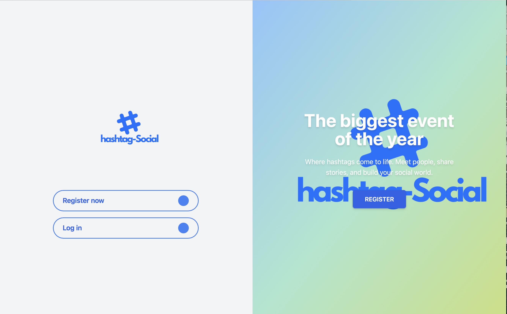
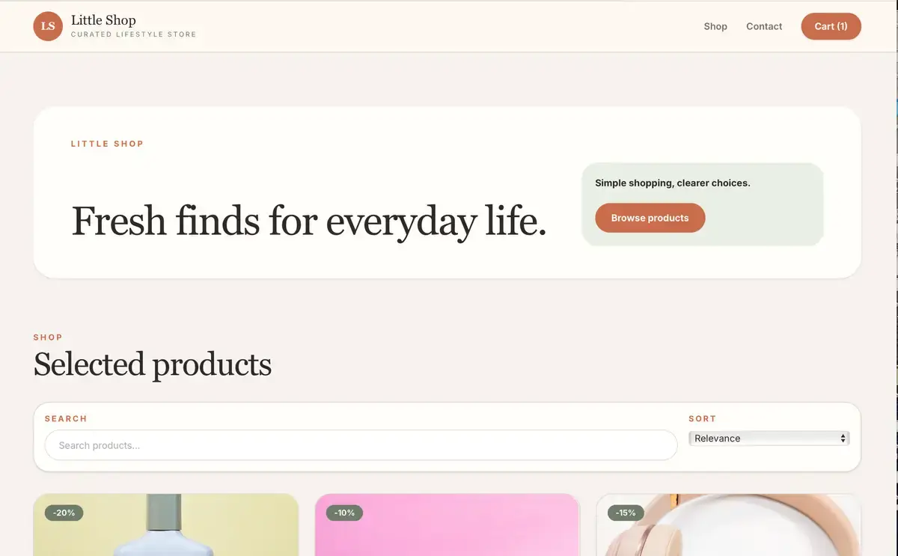
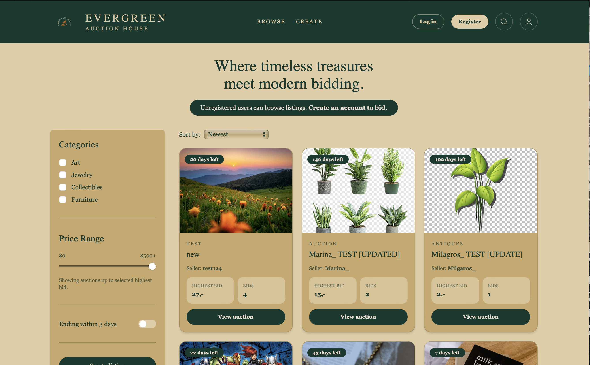

# Portfolio 2

This portfolio brings together three projects from my time studying Front-End Development at Noroff.

The purpose of Portfolio 2 was not simply to display completed coursework. I wanted to revisit projects I had already delivered, identify weaknesses, make meaningful improvements and present them in a way that feels closer to how I would showcase work to a potential employer.

Each project includes its own case page with project context, improvements made, technologies used and links to both the live site and GitHub repository.

---

# Live Portfolio

https://portfolio2-helena-cruse.netlify.app

---

# Featured Projects

## Hashtag Social

A responsive social media concept originally created for the CSS Frameworks course.

When revisiting the project for Portfolio 2, I focused on presentation, hierarchy and usability. The original solution met the assignment requirements, but it felt too much like a school submission and not enough like a finished product.

### Improvements

- Redesigned the feed experience
- Redesigned the profile page
- Improved content hierarchy and spacing
- Enhanced responsiveness across screen sizes

### Screenshot



### Links

**Live Site**

https://hashtagsoscial.netlify.app

**Repository**

https://github.com/helena-cruse/css-frameworks-social

---

## Little Shop

A modern ecommerce application built with Next.js, React, TypeScript and the Noroff API.

This project focused heavily on API-driven content, product discovery and ecommerce user flows. During Portfolio 2, I revisited the visual design and improved key parts of the shopping experience.

### Improvements

- Redesigned the homepage hero section
- Refined shopping flow and user interactions
- Fixed navigation between product listings and product detail pages

### Screenshot



### Links

**Live Site**

https://helena-cruse-jsfw2026.netlify.app

**Repository**

https://github.com/NoroffFEU/jsfw-2025-v1-helena-m-c

---

## Evergreen Auction House

Semester Project 2 and the most feature-rich project included in this portfolio.

The application combines authentication, listing creation, profile management and bidding functionality through the Noroff Auction API.

For Portfolio 2, I focused on making the browsing experience easier to use and improving the overall presentation of auction listings.

### Improvements

- Improved auction browsing and listing presentation
- Added working price range filtering
- Added an ending-soon filter for auctions ending within three days

### Screenshot



### Links

**Live Site**

https://evergreen-auction.netlify.app

**Repository**

https://github.com/helena-cruse/Evergreen-Auction-House

---

# Built With

- React
- Vite
- React Router
- Framer Motion
- Lenis
- CSS
- Netlify

---

# Features

- Responsive portfolio website
- Dedicated case page for each project
- Project screenshots
- Live project links
- GitHub repository links
- Animated page transitions
- Optimised WebP images
- Copy-link functionality
- Responsive layouts across desktop, tablet and mobile

---

# Getting Started

## Install dependencies

```bash
npm install
```

## Run locally

```bash
npm run dev
```

## Build production version

```bash
npm run build
```

## Preview production build

```bash
npm run preview
```

---

# Folder Structure

```text
public/
 ├── images/
 └── favicon.svg

src/
 ├── components/
 ├── data/
 ├── pages/
 ├── App.jsx
 ├── main.jsx
 └── index.css
```

---

# What I Learned

The biggest lesson from Portfolio 2 was learning how much stronger a project can become when revisited after the initial delivery.

When these projects were originally submitted, my focus was primarily on functionality and meeting the assignment requirements. Revisiting them months later allowed me to evaluate them from a different perspective. Instead of asking whether something worked, I found myself asking whether it felt clear, intentional and ready to present professionally.

The process also reinforced my growing interest in the connection between frontend development and UX. Small decisions around hierarchy, spacing, navigation and interaction often have a greater impact on the user experience than adding new features.

Portfolio 2 became an exercise in refinement rather than creation. It taught me how to critically evaluate my own work and improve it with a stronger focus on usability, presentation and overall product quality.

---

# Author

Helena Cruse

**Portfolio**

https://portfolio2-helena-cruse.netlify.app

**GitHub**

https://github.com/helena-cruse

**LinkedIn**

https://www.linkedin.com/in/helena-cruse2001/
